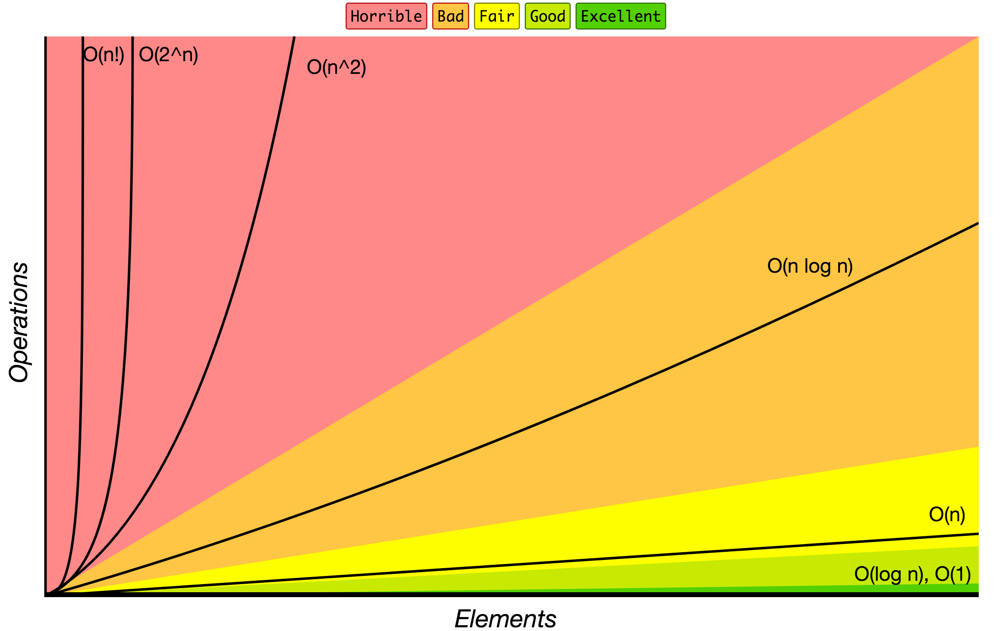

# TypeScript Algorithms and Data Structures

In this repository we have professional implementations of many popular algorithms and data structures, written in [TypeScript programming language](https://www.typescriptlang.org/). Each algorithm and data structure has abundant documentations
with simple explanations and links for further reading or watching online courses about the topic.

## Data Structures

A [data structure](https://en.wikipedia.org/wiki/Data_structure) is a particular way of organizing and storing data in a computer so that it can
be accessed and modified efficiently. More precisely, a data structure is a collection of data
values, the relationships among them, and the functions or operations that can be applied to
the data.

**Keep in mind that any data structure has its own trade-offs. And you need to pay attention more to why you're choosing a certain data structure rather than to how to implement it.**

* [Linked List](./src/data_structures/linked_list)
* [Doubly Linked List](./src/data_structures/doubly_linked_list)
* [Queue](./src/data_structures/queue)
* [Stack](./src/data_structures/stack)
* [Hash Table](./src/data_structures/hash_table)
* [Heap](./src/data_structures/heap)
* [Priority Queue](./src/data_structures/priority_queue)
* [Trie](./src/data_structures/trie)
* [Tree](./src/data_structures/tree)
  * [Binary Search Tree](./src/data_structures/tree/binary_search_tree)
  * [AVL Tree](./src/data_structures/tree/avl_tree)
  * [Red-Black Tree](./src/data_structures/tree/red_black_tree)
  * [Segment Tree](./src/data_structures/tree/segment_tree)
  * [Fenwick Tree](./src/data_structures/tree/fenwick_tree)
* [Graph](./src/data_structures/graph)
* [Disjoint Set](./src/data_structures/disjoint_set)
* [Bloom Filter](./src/data_structures/bloom_filter)
* [LRU Cache](./src/data_structures/lru_cache/)

## Algorithms

An [algorithm](https://en.wikipedia.org/wiki/Algorithm) is an unambiguous specification of how to solve a class of problems. It is
a set of rules that precisely define a sequence of operations.

### Algorithms by Topic

* **Math**
  * [Bit Manipulation](./src/algorithms/math/bits) - set/get/update/clear bits, multiplication/division by two, make negative etc.
  * [Binary Floating Point](./src/algorithms/math/binary_floating_point) - binary representation of the floating-point numbers.
  * [Factorial](./src/algorithms/math/factorial)
  * [Fibonacci Number](./src/algorithms/math/fibonacci) - classic and closed-form versions
  * [Prime Factors](./src/algorithms/math/prime_factors) - finding prime factors and counting them using Hardy-Ramanujan's theorem
  * [Primality Test](./src/algorithms/math/primality_test) (trial division method)
  * [Euclidean Algorithm](./src/algorithms/math/euclidean_algorithm) - calculate the Greatest Common Divisor (GCD)
  * [Least Common Multiple](./src/algorithms/math/least_common_multiple) (LCM)
  * [Sieve of Eratosthenes](./src/algorithms/math/sieve_of_eratosthenes) - finding all prime numbers up to any given limit
  * [Is Power of Two](./src/algorithms/math/is_power_of_two) - check if the number is power of two (naive and bitwise algorithms)
  * [Pascal's Triangle](./src/algorithms/math/pascal_triangle)
  * [Complex Number](./src/algorithms/math/complex_number) - complex numbers and basic operations with them
  * [Radian & Degree](./src/algorithms/math/radian) - radians to degree and backwards conversion
  * [Fast Powering](./src/algorithms/math/fast_powering)
  * [Horner's method](./src/algorithms/math/horner_method) - polynomial evaluation
  * [Matrices](./src/algorithms/math/matrix) - matrices and basic matrix operations (multiplication, transposition, etc.)
  * [Euclidean Distance](./src/algorithms/math/euclidean_distance) - distance between two points/vectors/matrices
  * [Integer Partition](./src/algorithms/math/integer_partition)
  * [Square Root](./src/algorithms/math/square_root) - Newton's method
  * [Liu Hui π Algorithm](./src/algorithms/math/liu_hui) - approximate π calculations based on N-gons
  * [Discrete Fourier Transform](./src/algorithms/math/fourier_transform) - decompose a function of time (a signal) into the frequencies that make it up
* **Sets**
  * [Cartesian Product](./src/algorithms/sets/cartesian_product) - product of multiple sets
  * [Fisher–Yates Shuffle](./src/algorithms/sets/fisher_yates) - random permutation of a finite sequence
  * [Power Set](./src/algorithms/sets/power_set) - all subsets of a set (bitwise, backtracking, and cascading solutions)
  * [Permutations](./src/algorithms/sets/permutations) (with and without repetitions)
  * [Combinations](./src/algorithms/sets/combinations) (with and without repetitions)
  * [Longest Common Subsequence](./src/algorithms/sets/longest_common_subsequence) (LCS)
  * [Longest Increasing Subsequence](./src/algorithms/sets/longest_increasing_subsequence)
  * [Shortest Common Supersequence](./src/algorithms/sets/shortest_common_supersequence) (SCS)
  * [Knapsack Problem](./src/algorithms/sets/knapsack_problem) - "0/1" and "Unbound" ones
  * [Maximum Subarray](./src/algorithms/sets/maximum_subarray) - "Brute Force" and "Dynamic Programming" (Kadane's) versions
  * [Combination Sum](./src/algorithms/sets/combination_sum) - find all combinations that form specific sum
* **Strings**
  * [Hamming Distance](./src/algorithms/string/hamming_distance) - number of positions at which the symbols are different
  * [Palindrome](./src/algorithms/string/palindrome) - check if the string is the same in reverse
  * [Levenshtein Distance](./src/algorithms/string/levenshtein_distance) - minimum edit distance between two sequences
  * [Knuth–Morris–Pratt Algorithm](./src/algorithms/string/knuth_morris_pratt) (KMP Algorithm) - substring search (pattern matching)
  * [Z Algorithm](./src/algorithms/string/z_algorithm) - substring search (pattern matching)
  * [Rabin Karp Algorithm](./src/algorithms/string/rabin_karp) - substring search
  * [Longest Common Substring](./src/algorithms/string/longest_common_substring)
  * [Regular Expression Matching](./src/algorithms/string/regular_expression_matching)
* **Searches**
  * [Linear Search](./src/algorithms/search/linear_search)
  * [Jump Search](./src/algorithms/search/jump_search) (or Block Search) - search in sorted array
  * [Binary Search](./src/algorithms/search/binary_search) - search in sorted array
  * [Interpolation Search](./src/algorithms/search/interpolation_search) - search in uniformly distributed sorted array
* **Sorting**
  * [Bubble Sort](./src/algorithms/sorting/bubble_sort)
  * [Selection Sort](./src/algorithms/sorting/selection_sort)
  * [Insertion Sort](./src/algorithms/sorting/insertion_sort)
  * [Heap Sort](./src/algorithms/sorting/heap_sort)
  * [Merge Sort](./src/algorithms/sorting/merge_sort)
  * [Quicksort](./src/algorithms/sorting/quick_sort) - in-place and non-in-place implementations
  * [Shellsort](./src/algorithms/sorting/shell_sort)
  * [Counting Sort](./src/algorithms/sorting/counting_sort)
  * [Radix Sort](./src/algorithms/sorting/radix_sort)
  * [Bucket Sort](./src/algorithms/sorting/bucket_sort)
* **Linked Lists**
  * [Straight Traversal](./src/algorithms/linked_list/traversal)
  * [Reverse Traversal](./src/algorithms/linked_list/reverse_traversal)
* **Trees**
  * [Depth-First Search](./src/algorithms/tree/depth_first_search) (DFS)
  * [Breadth-First Search](./src/algorithms/tree/breadth_first_search) (BFS)
* **Graphs**
  * [Depth-First Search](./src/algorithms/graph/depth_first_search) (DFS)
  * [Breadth-First Search](./src/algorithms/graph/breadth_first_search) (BFS)
  * [Kruskal’s Algorithm](./src/algorithms/graph/kruskal) - finding Minimum Spanning Tree (MST) for weighted undirected graph
  * [Dijkstra Algorithm](./src/algorithms/graph/dijkstra) - finding the shortest paths to all graph vertices from single vertex
  * [Bellman-Ford Algorithm](./src/algorithms/graph/bellman_ford) - finding the shortest paths to all graph vertices from single vertex
  * [Floyd-Warshall Algorithm](./src/algorithms/graph/floyd_warshall) - find the shortest paths between all pairs of vertices
  * [Detect Cycle](./src/algorithms/graph/detect_cycle) - for both directed and undirected graphs (DFS and Disjoint Set based versions)
  * [Prim’s Algorithm](./src/algorithms/graph/prim) - finding Minimum Spanning Tree (MST) for weighted undirected graph
  * [Topological Sorting](./src/algorithms/graph/topological_sorting) - DFS method
  * [Articulation Points](./src/algorithms/graph/articulation_points) - Tarjan's algorithm (DFS based)
  * [Bridges](./src/algorithms/graph/bridges) - DFS based algorithm
  * [Eulerian Path and Eulerian Circuit](./src/algorithms/graph/eulerian_path) - Fleury's algorithm - Visit every edge exactly once
  * [Hamiltonian Cycle](./src/algorithms/graph/hamiltonian_cycle) - Visit every vertex exactly once
  * [Strongly Connected Components](./src/algorithms/graph/strongly_connected_components) - Kosaraju's algorithm
  * [Travelling Salesman Problem](./src/algorithms/graph/travelling_salesman) - shortest possible route that visits each city and returns to the origin city
* **Cryptography**
  * [Polynomial Hash](./src/algorithms/cryptography/polynomial_hash) - rolling hash function based on polynomial
  * [Rail Fence Cipher](./src/algorithms/cryptography/rail_fence_cipher) - a transposition cipher algorithm for encoding messages
  * [Caesar Cipher](./src/algorithms/cryptography/caesar_cipher) - simple substitution cipher
  * [Hill Cipher](./src/algorithms/cryptography/hill_cipher) - substitution cipher based on linear algebra
* **Machine Learning**
  * [k-NN](./src/algorithms/ml/knn) - k-nearest neighbors classification algorithm
  * [k-Means](./src/algorithms/ml/k_means) - k-Means clustering algorithm
* **Statistics**
  * [Weighted Random](./src/algorithms/statistics/weighted_random) - select the random item from the list based on items' weights
* **Uncategorized**
  * [Tower of Hanoi](./src/algorithms/uncategorized/hanoi_tower)
  * [Square Matrix Rotation](./src/algorithms/uncategorized/square_matrix_rotation) - in-place algorithm
  * [Jump Game](./src/algorithms/uncategorized/jump_game) - backtracking, dynamic programming (top-down + bottom-up) and greedy examples
  * [Unique Paths](./src/algorithms/uncategorized/unique_paths) - backtracking, dynamic programming and Pascal's Triangle based examples
  * [Rain Terraces](./src/algorithms/uncategorized/rain_terraces) - trapping rain water problem (dynamic programming and brute force versions)
  * [Recursive Staircase](./src/algorithms/uncategorized/recursive_staircase) - count the number of ways to reach to the top (4 solutions)
  * [Best Time To Buy Sell Stocks](./src/algorithms/uncategorized/best_time_to_buy_sell_stocks) - divide and conquer and one-pass examples
  * [Valid Parentheses](./src/algorithms/stack/valid_parentheses) - check if a string has valid parentheses (using stack)
  * [N-Queens Problem](./src/algorithms/uncategorized/n_queens)
  * [Knight's Tour](./src/algorithms/uncategorized/knight_tour)

### Algorithms by Paradigm

An algorithmic paradigm is a generic method or approach which underlines the design of a class
of algorithms. It is an abstraction higher than the notion of an algorithm, just as an
algorithm is an abstraction higher than a computer program.

* **Brute Force** - Looks at all the possibilities and selects the best solution :
  * [Linear Search](./src/algorithms/search/linear_search)
  * [Rain Terraces](./src/algorithms/uncategorized/rain_terraces) - trapping rain water problem
  * [Recursive Staircase](./src/algorithms/uncategorized/recursive_staircase) - count the number of ways to reach the top
  * [Maximum Subarray](./src/algorithms/sets/maximum_subarray)
  * [Travelling Salesman Problem](./src/algorithms/graph/travelling_salesman) - shortest possible route that visits each city and returns to the origin city
  * [Discrete Fourier Transform](./src/algorithms/math/fourier_transform) - decompose a function of time (a signal) into the frequencies that make it up
* **Greedy** - choose the best option at the current time, without any consideration for the future
  * [Jump Game](./src/algorithms/uncategorized/jump_game)
  * [Unbound Knapsack Problem](./src/algorithms/sets/knapsack_problem)
  * [Dijkstra Algorithm](./src/algorithms/graph/dijkstra) - finding the shortest path to all graph vertices
  * [Prim’s Algorithm](./src/algorithms/graph/prim) - finding Minimum Spanning Tree (MST) for weighted undirected graph
  * [Kruskal’s Algorithm](./src/algorithms/graph/kruskal) - finding Minimum Spanning Tree (MST) for weighted undirected graph
* **Divide and Conquer** - divide the problem into smaller parts and then solve those parts
  * [Binary Search](./src/algorithms/search/binary_search)
  * [Tower of Hanoi](./src/algorithms/uncategorized/hanoi_tower)
  * [Pascal's Triangle](./src/algorithms/math/pascal_triangle)
  * [Euclidean Algorithm](./src/algorithms/math/euclidean_algorithm) - calculate the Greatest Common Divisor (GCD)
  * [Merge Sort](./src/algorithms/sorting/merge_sort)
  * [Quicksort](./src/algorithms/sorting/quick_sort)
  * [Tree Depth-First Search](./src/algorithms/tree/depth_first_search) (DFS)
  * [Graph Depth-First Search](./src/algorithms/graph/depth_first_search) (DFS)
  * [Matrices](./src/algorithms/math/matrix) - generating and traversing the matrices of different shapes
  * [Jump Game](./src/algorithms/uncategorized/jump_game)
  * [Fast Powering](./src/algorithms/math/fast_powering)
  * [Best Time To Buy Sell Stocks](./src/algorithms/uncategorized/best_time_to_buy_sell_stocks) - divide and conquer and one-pass examples
  * [Permutations](./src/algorithms/sets/permutations) (with and without repetitions)
  * [Combinations](./src/algorithms/sets/combinations) (with and without repetitions)
  * [Maximum Subarray](./src/algorithms/sets/maximum_subarray)
* **Dynamic Programming** - build up a solution using previously found sub-solutions
  * [Fibonacci Number](./src/algorithms/math/fibonacci)
  * [Jump Game](./src/algorithms/uncategorized/jump_game)
  * [Unique Paths](./src/algorithms/uncategorized/unique_paths)
  * [Rain Terraces](./src/algorithms/uncategorized/rain_terraces) - trapping rain water problem
  * [Recursive Staircase](./src/algorithms/uncategorized/recursive_staircase) - count the number of ways to reach the top
  * [Levenshtein Distance](./src/algorithms/string/levenshtein_distance) - minimum edit distance between two sequences
  * [Longest Common Subsequence](./src/algorithms/sets/longest_common_subsequence) (LCS)
  * [Longest Common Substring](./src/algorithms/string/longest_common_substring)
  * [Longest Increasing Subsequence](./src/algorithms/sets/longest_increasing_subsequence)
  * [Shortest Common Supersequence](./src/algorithms/sets/shortest_common_supersequence)
  * [0/1 Knapsack Problem](./src/algorithms/sets/knapsack_problem)
  * [Integer Partition](./src/algorithms/math/integer_partition)
  * [Maximum Subarray](./src/algorithms/sets/maximum_subarray)
  * [Bellman-Ford Algorithm](./src/algorithms/graph/bellman_ford) - finding the shortest path to all graph vertices
  * [Floyd-Warshall Algorithm](./src/algorithms/graph/floyd_warshall) - find the shortest paths between all pairs of vertices
  * [Regular Expression Matching](./src/algorithms/string/regular_expression_matching)
* **Backtracking** - similarly to brute force, try to generate all possible solutions, but each time you generate the next solution, you test
if it satisfies all conditions and only then continue generating subsequent solutions. Otherwise, backtrack and go on a
different path to finding a solution. Normally the DFS traversal of state-space is being used.
  * [Jump Game](./src/algorithms/uncategorized/jump_game)
  * [Unique Paths](./src/algorithms/uncategorized/unique_paths)
  * [Power Set](./src/algorithms/sets/power_set) - all subsets of a set
  * [Hamiltonian Cycle](./src/algorithms/graph/hamiltonian_cycle) - Visit every vertex exactly once
  * [N-Queens Problem](./src/algorithms/uncategorized/n_queens)
  * [Knight's Tour](./src/algorithms/uncategorized/knight_tour)
  * [Combination Sum](./src/algorithms/sets/combination_sum) - find all combinations that form specific sum
* **Branch & Bound** - remember the lowest-cost solution found at each stage of the backtracking
search, and use the cost of the lowest-cost solution found so far as a lower bound on the cost of
a least-cost solution to the problem in order to discard partial solutions with costs larger than the
lowest-cost solution found so far. Normally, BFS traversal in combination with DFS traversal of state-space
tree is being used.

## How to use this repository

**Install all dependencies**

```
bun install
```

**Run all tests**

```
bun run test
```

**Run tests by name**

```
bun test Queue.test.ts
```

## Useful Information

### References

- [▶ Data Structures and Algorithms on YouTube](https://www.youtube.com/playlist?list=PLLXdhg_r2hKA7DPDsunoDZ-Z769jWn4R8)
- [✍🏻 Data Structure Sketches](https://okso.app/showcase/data-structures)

### Big O Notation

*Big O notation* is used to classify algorithms according to how their running time or space requirements grow as the input size grows.
On the chart below, you may find the most common orders of growth of algorithms specified in Big O notation.



Source: [Big O Cheat Sheet](http://bigocheatsheet.com/).

Below is the list of some of the most used Big O notations and their performance comparisons against different sizes of the input data.

| Big O Notation | Type        | Computations for 10 elements | Computations for 100 elements | Computations for 1000 elements  |
| -------------- | ----------- | ---------------------------- | ----------------------------- | ------------------------------- |
| **O(1)**       | Constant    | 1                            | 1                             | 1                               |
| **O(log N)**   | Logarithmic | 3                            | 6                             | 9                               |
| **O(N)**       | Linear      | 10                           | 100                           | 1000                            |
| **O(N log N)** | n log(n)    | 30                           | 600                           | 9000                            |
| **O(N^2)**     | Quadratic   | 100                          | 10000                         | 1000000                         |
| **O(2^N)**     | Exponential | 1024                         | 1.26e+29                      | 1.07e+301                       |
| **O(N!)**      | Factorial   | 3628800                      | 9.3e+157                      | 4.02e+2567                      |

### Data Structure Operations Complexity

| Data Structure          | Access    | Search    | Insertion | Deletion  | Comments  |
| ----------------------- | :-------: | :-------: | :-------: | :-------: | :-------- |
| **Array**               | 1         | n         | n         | n         |           |
| **Stack**               | n         | n         | 1         | 1         |           |
| **Queue**               | n         | n         | 1         | 1         |           |
| **Linked List**         | n         | n         | 1         | n         |           |
| **Hash Table**          | -         | n         | n         | n         | In case of perfect hash function costs would be O(1) |
| **Binary Search Tree**  | n         | n         | n         | n         | In case of balanced tree costs would be O(log(n)) |
| **B-Tree**              | log(n)    | log(n)    | log(n)    | log(n)    |           |
| **Red-Black Tree**      | log(n)    | log(n)    | log(n)    | log(n)    |           |
| **AVL Tree**            | log(n)    | log(n)    | log(n)    | log(n)    |           |
| **Bloom Filter**        | -         | 1         | 1         | -         | False positives are possible while searching |

### Array Sorting Algorithms Complexity

| Name                  | Best            | Average             | Worst               | Memory    | Stable    | Comments  |
| --------------------- | :-------------: | :-----------------: | :-----------------: | :-------: | :-------: | :-------- |
| **Bubble sort**       | n               | n<sup>2</sup>       | n<sup>2</sup>       | 1         | Yes       |           |
| **Insertion sort**    | n               | n<sup>2</sup>       | n<sup>2</sup>       | 1         | Yes       |           |
| **Selection sort**    | n<sup>2</sup>   | n<sup>2</sup>       | n<sup>2</sup>       | 1         | No        |           |
| **Heap sort**         | n&nbsp;log(n)   | n&nbsp;log(n)       | n&nbsp;log(n)       | 1         | No        |           |
| **Merge sort**        | n&nbsp;log(n)   | n&nbsp;log(n)       | n&nbsp;log(n)       | n         | Yes       |           |
| **Quick sort**        | n&nbsp;log(n)   | n&nbsp;log(n)       | n<sup>2</sup>       | log(n)    | No        | Quicksort is usually done in-place with O(log(n)) stack space |
| **Shell sort**        | n&nbsp;log(n)   | depends on gap sequence   | n&nbsp;(log(n))<sup>2</sup>  | 1         | No         |           |
| **Counting sort**     | n + r           | n + r               | n + r               | n + r     | Yes       | r - biggest number in array |
| **Radix sort**        | n * k           | n * k               | n * k               | n + k     | Yes       | k - length of longest key |

